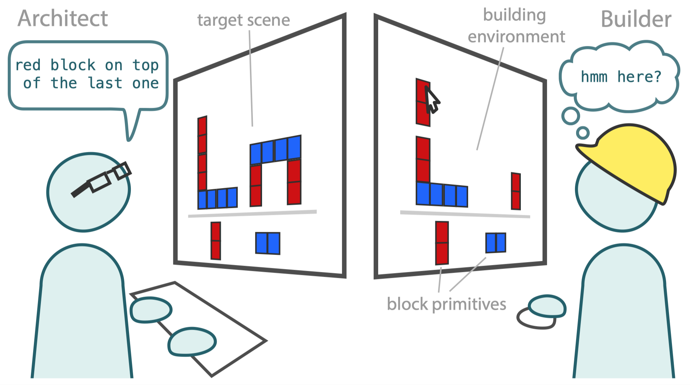

# Learning to communicate about shared procedural abstractions

Project investigating how humans learn and communicate about abstract procedures during physical construction.

## Paired building task

  </img> 

Participants are paired and designated the role of Architect or Builder.
Architects see a target scene, and send text instructions to the Builder.
The Builder reconstructs these by placing blocks in a Building environment.

## Experiment

We ran an experiment to see how Architects' instructions changed over repeated building experience.
We presented 12 scenes composed of the same three block towers to each Architect. 

Code for this experiment can be found in `behavioral_experiments/paired_building`.

## Model

## Navigating repo

Analysis, experiments, and model are in respective directories.
Finalized analyses/ files for specific destinations (e.g. cogsci 2021) are prefixed e.g. cogsci21.

### Behavioral Experiments
`./behavioral_experiments`

Paired building experiment (cogsci21): `behavioral_experiments/paired_building`

### Model
`./model`

Contains two parts: library learning, and language coordination.

See `./model/README.md` for more details

### Analysis

Analysis for specific experiments is stored in e.g. `./analysis/experiment_name`
For paired building experiment (cogsci21): `./analysis/paired_building`

For *model* analysis, see `./model/analysis`

### Paper
Here is a link to the paper repo: https://github.com/cogtoolslab/compositional-abstractions-latex.
